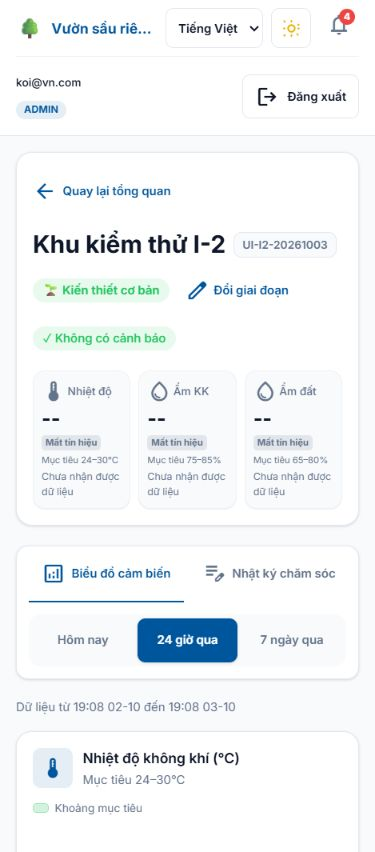
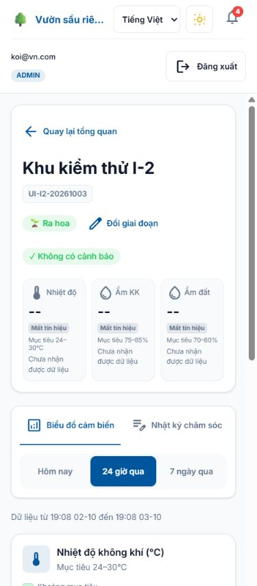
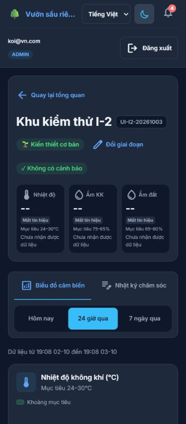
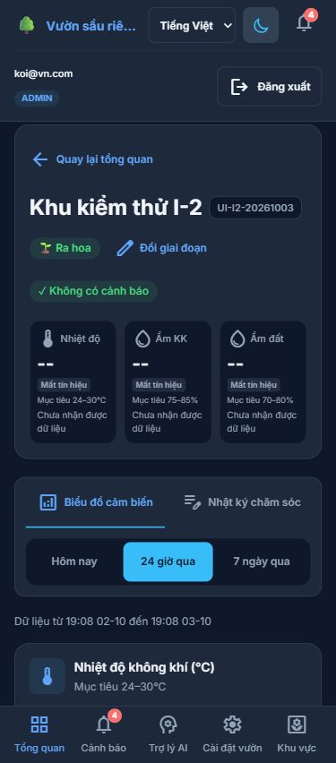
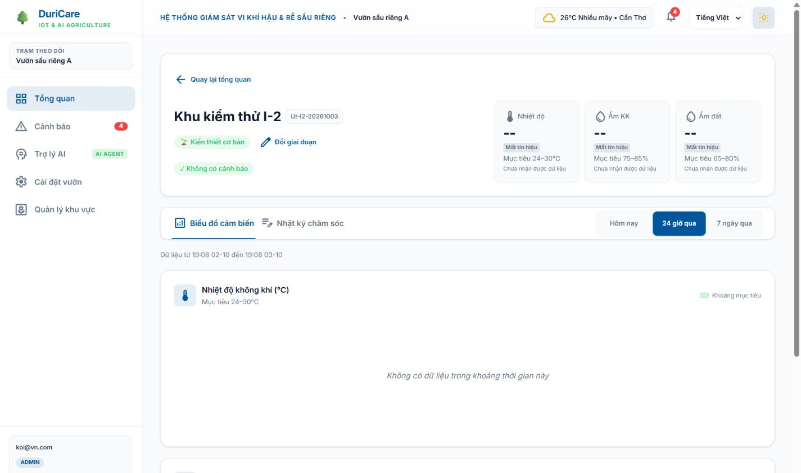
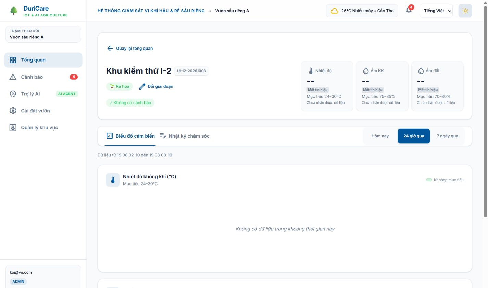
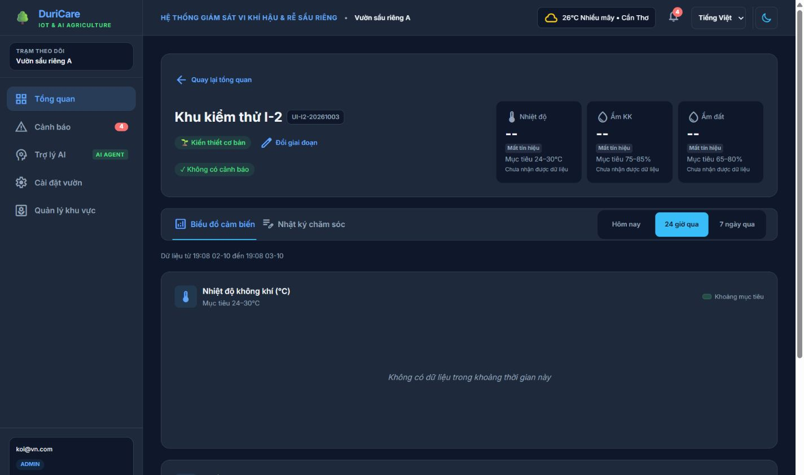
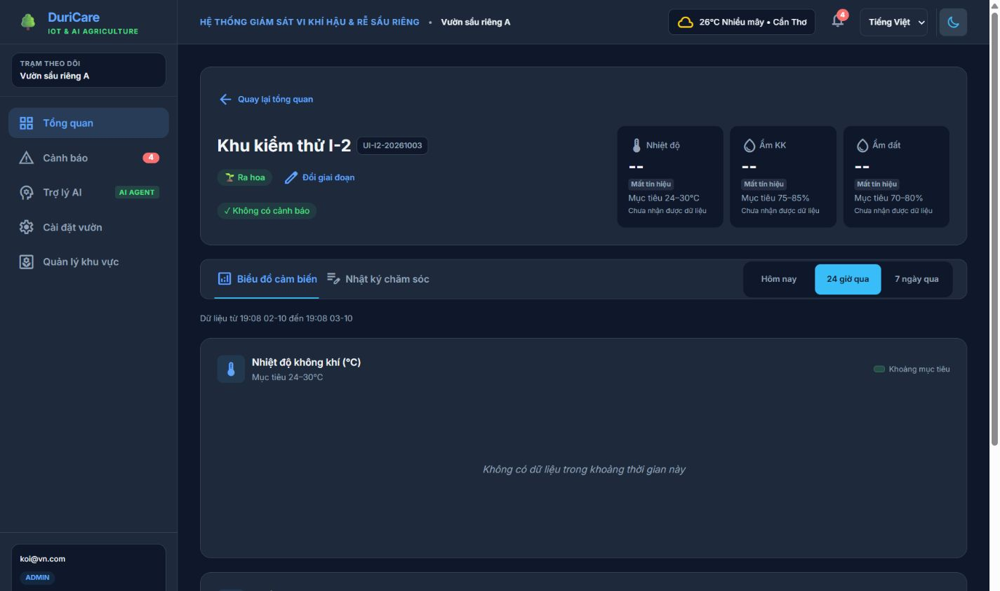

# Phase I-3 — Growth-stage control

Added to the existing Zone Detail header, beside the growth-stage pill. No new route or role gate: ADMIN and OWNER retain access through the existing authenticated route and backend zone-scoped authorization.

## Contract and implementation

- `PATCH /api/trees/{id}/growth-stage` accepts `{ "growthStage": "RA_HOA" }` and returns the updated Tree.
- The existing zone response already provides `representativeTreeId`. The control does not use the ADMIN-only tree GET endpoint, so OWNER can use it too.
- The inline React Hook Form select uses all seven entries of the existing `GROWTH_STAGE_LABELS` dictionary and defaults to the current stage. Confirm/Cancel and selection are disabled while saving; a missing representative tree disables the control with an explanation.
- `api/trees.ts` uses the existing shared axios client. `useGrowthStage` owns the mutation, duplicate-submit guard, retryable error, and brief success message. `GrowthStageControl` receives presentation props.
- After PATCH succeeds, `useZoneDetail.applyGrowthStage` updates the pill immediately, then the page refreshes the overview and existing zone/chart data. Metric chips and chart bands reuse backend statuses and target ranges, without computing thresholds in the frontend.
- If overview refresh fails, metrics for a different stage are hidden with Retry instead of displaying old target ranges. No previous-stage band is passed to the charts.

## Live verification — 2026-10-03

Backend: localhost:8386. Frontend: localhost:5173. CORS preflight for the PATCH returned 200 and allowed the frontend origin, credentials, Authorization and Content-Type.

### ADMIN

Real zone `UI-I2-20261003`, farm 3, representative tree 5:

1. Before: `KIEN_THIET_CO_BAN`, soil target **65–80%**.
2. UI Confirm sent `PATCH /api/trees/5/growth-stage` with `{ "growthStage": "RA_HOA" }`; HTTP **200**, Bearer present.
3. After: pill **Ra hoa**, soil chip and chart target label **70–80%** from the refreshed overview.

Evidence: [before.json](verification/growth-stage-phase-i3/before.json), [after.json](verification/growth-stage-phase-i3/after.json). The trace includes both the reset to the before state and the final RA_HOA change; these are real backend calls. This test zone has no sensor readings, so its NO_SIGNAL state and existing latest-reading 404 responses are expected. The test zone remains at RA_HOA.

### OWNER and chart bands

Real `zoneA`, farm 1, representative tree 1:

1. Before: `PHAT_TRIEN_TRAI`, soil target **60–80%**, current soil moisture **76%**, NORMAL.
2. OWNER submitted `DAU_TRAI`; PATCH returned **200**. Pill **Đậu trái**, target **40–70%**, status HIGH (**Cao hơn ngưỡng**).
3. The seven-day soil chart contained **343** real readings. Its ReferenceArea changed from y1=60/y2=80 to y1=40/y2=70, including the rendered SVG geometry.
4. Restored `PHAT_TRIEN_TRAI` through the same UI: PATCH **200**, target **60–80%**, status NORMAL again. zoneA was not left in the temporary test stage.

Evidence: [owner-before.json](verification/growth-stage-phase-i3/owner-before.json), [owner-after.json](verification/growth-stage-phase-i3/owner-after.json), [owner-restored.json](verification/growth-stage-phase-i3/owner-restored.json). Fresh live OWNER navigation had no console errors.

### State and layout checks

Separate fixture entry points simulate mutation states without sending real PATCH requests:

- Loading: select, Confirm, Cancel and toggle disabled.
- Error: HTTP 503 shows a Vietnamese error; selection is retained and retrying Confirm succeeds.
- Empty: absent representative tree disables editing with explanatory text.
- Overview-refresh failure: the successfully changed pill remains; old soil target 65–80% disappears and Retry is offered. [Proof](verification/growth-stage-phase-i3/refresh-error-proof.json).
- At 375px and 768px, no horizontal overflow was observed. Existing safe-area shell and metric layout were preserved.

`npm run build` passed. `npm run lint` passed with five existing warnings in useAlerts/useOverview/OverviewContext and no new warnings.

## Screenshots

These images show real ADMIN backend data, with the same before/after transition across all four viewport/theme combinations. The test zone intentionally has no readings; the real zoneA chart-band verification is recorded separately above.

| View | Before | After |
| --- | --- | --- |
| 375px light |  |  |
| 375px dark |  |  |
| 1440px light |  |  |
| 1440px dark |  |  |

Inline form: [375px](verification/growth-stage-phase-i3/form-open-375.jpg), [1440px](verification/growth-stage-phase-i3/form-open-1440.jpg).

The live recorder excludes auth requests, cookies and actual Bearer values, retaining only `bearerPresent: true/false`. Fixtures are isolated from the normal app route.
